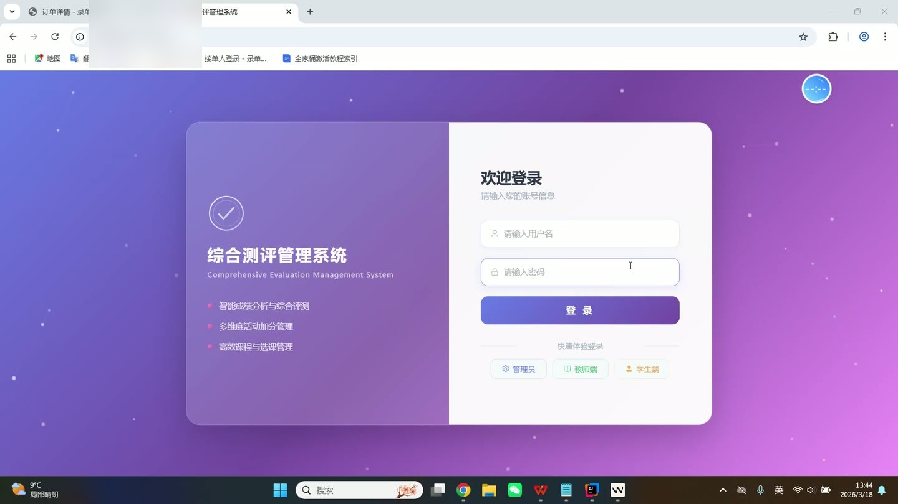
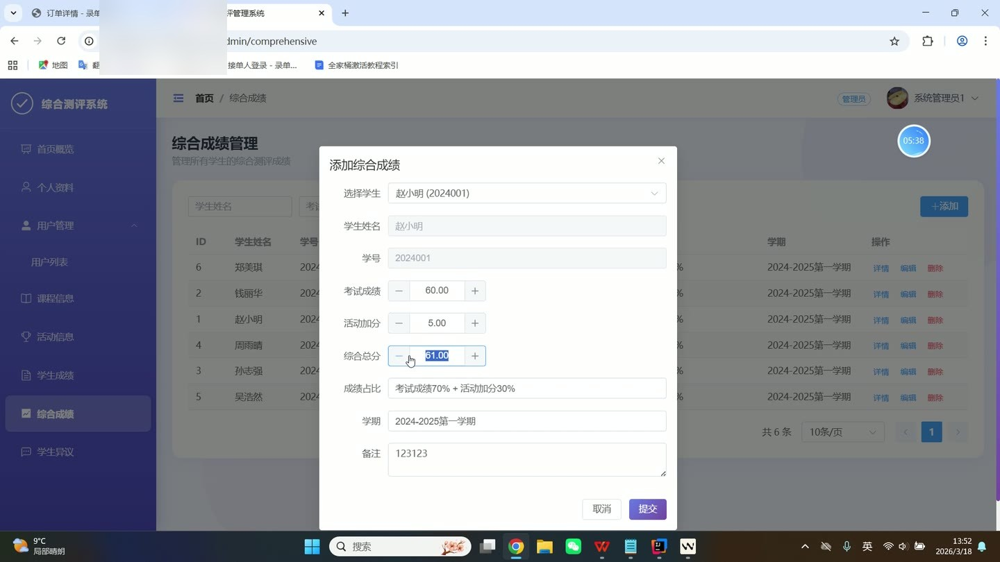
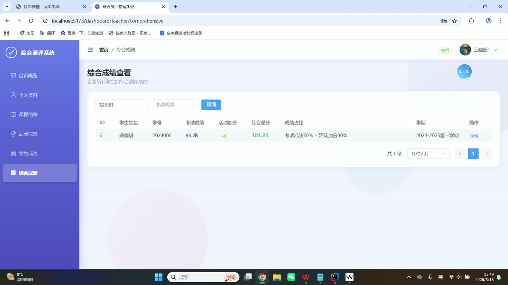
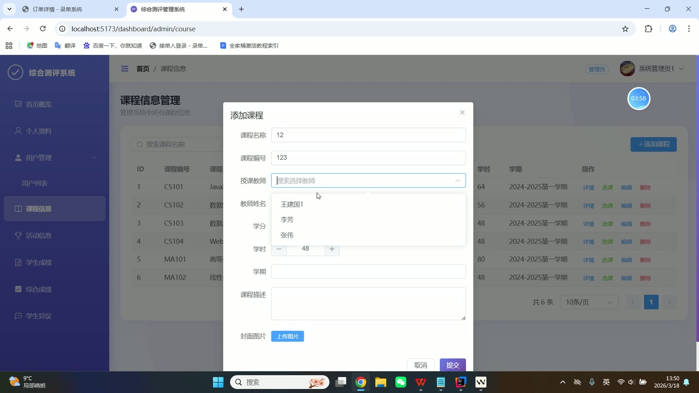
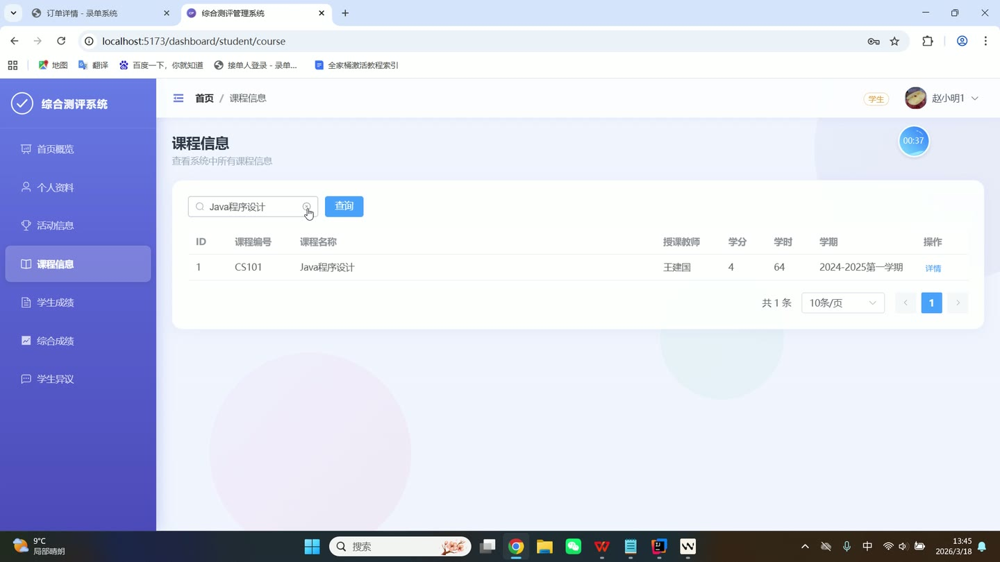

# (附文档)Springboot2+Vue3+MySQL 大学生综合素质测评管理系统

**技术栈**：Springboot2、Vue3、MySQL

### 系统简介

大学生综合素质测评管理系统是一套基于 Spring Boot 2 + Vue 3 + MySQL 的前后端分离系统，包含管理员、教师、学生三种角色。系统围绕学生综合素质评估业务，提供用户管理、课程管理、活动管理、成绩管理、综合评测、异议申诉等核心功能，支持多维度条件检索、数据统计展示和文件上传，旨在实现学生综合素质的数字化、透明化管理。
 
### 核心功能
 
### 管理员端

 
- 查看系统仪表盘统计面板，展示学生数、教师数、课程数、活动数、成绩记录数、综合评测数、异议申诉数等关键指标 
- 管理所有用户（管理员/教师/学生），支持按角色筛选用户列表、查看用户详情（含学院/专业/班级/学号/手机/邮箱等字段） 
- 新增用户，设置用户名、密码（默认 123456，MD5 加密存储）、角色、真实姓名、性别、手机号、邮箱、学号、学院、专业、班级等信息 
- 编辑用户信息，支持修改除用户名外的所有字段，密码为空时不更新密码 
- 修改用户密码，需校验原密码正确性后更新为新密码 
- 删除用户，支持按 ID 删除指定用户 
- 查看用户统计，获取管理员/教师/学生各自数量及总用户数 
- 管理课程信息，支持按课程名称模糊查询课程列表，查看课程详情（课程名称、课程代码、任课教师、学分、课程类型、学期、描述） 
- 新增课程，填写课程名称、课程代码、任课教师、学分、课程类型、学期、描述等字段 
- 编辑课程信息，修改课程名称、任课教师、学分等字段 
- 删除课程，同时删除该课程下的所有选课记录 
- 查看课程下的选课学生列表，支持按课程 ID 查询已选学生 
- 同步选课学生，先清空该课程原有选课记录，再批量插入新的学生选课数据 
- 管理活动信息，支持按活动名称、所属学生、活动加分多条件模糊查询活动列表 
- 新增活动记录，选择所属学生（从学生列表中选择）、填写活动名称、活动类型（学科竞赛/社会实践/体育竞赛/文艺活动/创新创业/荣誉称号）、活动加分、活动日期、活动描述、上传活动图片 
- 查看活动详情，展示活动名称、所属学生、学号、活动类型、加分、日期、描述、图片 
- 删除活动记录 
- 管理学生成绩，支持按学生姓名、课程名称多条件模糊查询成绩列表 
- 新增成绩记录，选择学生、选择课程、填写考试名称、成绩分数、学期 
- 编辑成绩信息，修改学生、课程、考试名称、成绩、学期等字段 
- 删除成绩记录 
- 管理综合成绩，支持按学生姓名、考试成绩、成绩占比多条件查询 
- 新增综合成绩，选择学生，填写考试成绩、德育成绩、活动加分，自定义学业/德育/活动占比（默认 70%/20%/10%），系统自动计算综合总分 
- 查看综合成绩详情，展示学生姓名、学号、考试成绩、德育成绩、活动加分、综合总分、成绩占比、学期、备注 
- 删除综合成绩记录 
- 管理异议申诉，支持按学生姓名、学号查询申诉列表 
- 查看申诉详情，展示申诉学生、申诉类型、申诉内容、状态、回复 
- 回复申诉，更新申诉状态（如“待处理”改为“已处理”）并填写回复内容 
- 删除申诉记录
 
### 教师端

 
- 查看个人课程列表，仅显示当前教师负责的课程，支持按课程名称模糊查询 
- 查看课程下的选课学生列表，展示学生姓名、学号等信息 
- 管理课程下的学生成绩，支持按学生姓名、课程名称、考试名称多条件查询成绩 
- 新增成绩记录，选择课程、学生、填写考试名称、成绩、学期 
- 编辑成绩信息，修改成绩分数、考试名称等字段 
- 删除成绩记录 
- 管理活动信息，支持按活动名称、所属学生、活动加分查询活动列表 
- 新增活动记录，选择学生、填写活动名称、类型、加分、日期、描述、上传图片 
- 查看活动详情 
- 删除活动记录 
- 管理综合成绩，支持按学生姓名、考试成绩、成绩占比查询 
- 新增综合成绩，选择学生，填写考试成绩、德育成绩、活动加分，自定义占比，自动计算总分 
- 查看综合成绩详情 
- 删除综合成绩记录 
- 查看个人资料，修改个人信息（真实姓名、性别、手机号、邮箱、头像） 
- 修改个人密码，需校验原密码后更新为新密码
 
### 普通学生端

 
- 查看个人活动记录列表，支持按活动名称模糊查询，仅显示当前学生参与的活动 
- 新增个人活动记录，填写活动名称、活动类型、活动加分、活动日期、描述、上传图片 
- 查看活动详情 
- 查看个人课程列表，仅显示已选课程，支持按课程名称模糊查询 
- 选课操作，从课程列表中选择课程进行选课 
- 退课操作，取消已选课程 
- 查看个人成绩列表，支持按课程名称、考试名称多条件查询 
- 查看成绩详情 
- 查看个人综合成绩列表，支持按考试成绩、成绩占比条件查询 
- 查看综合成绩详情 
- 提交异议申诉，填写申诉类型、申诉内容，系统自动设置状态为“待处理” 
- 查看个人申诉记录列表，支持按学生姓名查询 
- 查看申诉详情，查看管理员/教师的回复内容 
- 查看个人资料，修改个人信息（真实姓名、性别、手机号、邮箱、头像） 
- 修改个人密码，需校验原密码后更新为新密码
 
### 技术栈

  后端框架 Spring Boot 2   ORM MyBatis（XML 映射）   权限 Session 会话管理 + 角色字段（admin/teacher/student）   前端框架 Vue 3（Composition API + TypeScript）   状态管理 Vue Router + localStorage   UI 组件库 Element Plus   构建工具 Vite   数据库 MySQL（MyBatis Mapper XML 实现 SQL）   文件上传 MultipartFile + 本地存储   密码加密 Apache Commons Codec MD5 
 
### 交付内容

 
- 后端完整源码 
- 前端完整源码 
- 数据库初始化脚本 
- 万字文档

## 界面展示

---

## 获取完整源码 + 万字文档

本仓库为项目介绍页。**完整前后端源码、数据库初始化脚本、万字项目文档**，请加微信 `kangkangcode`，或访问 [codekk.top](http://codekk.top) 获取。

可作课程设计 / 毕业设计参考，支持远程部署调试。